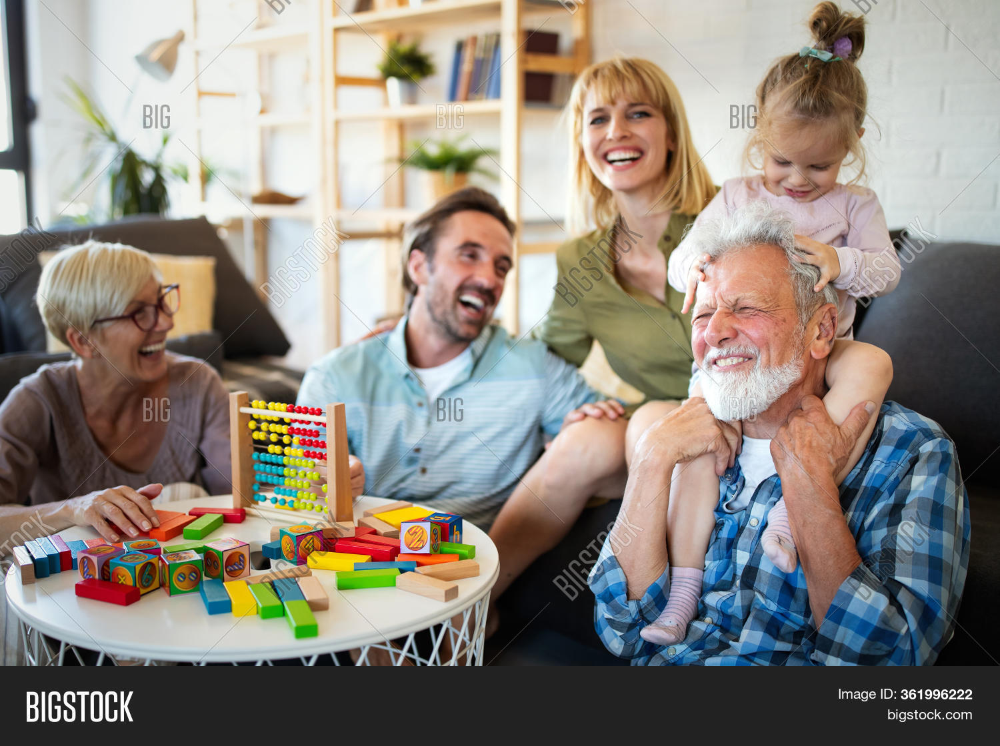

# 🎙️ VisionSpeak AI
### AI-Powered Image-to-Story & Text to Speech Generator using Google Gemini Vision


<p align="center">
  
</p>

## 🌟 Overview

VisionSpeak AI is an AI-powered multimodal application that transforms uploaded images into meaningful scene descriptions, creative stories, and natural-sounding speech.

Powered by **Google Gemini Vision** for image understanding and story generation, and **gTTS** for Text-to-Speech synthesis, the application provides an interactive experience through a modern Streamlit interface.

---

## 🚀 Live Demo

🌐 https://visionspeak-ai.streamlit.app/

---

## ✨ Features

- 🖼️ Upload JPG, JPEG, and PNG images
- 🤖 AI-powered image understanding using Google Gemini
- 📝 Generate detailed image descriptions
- 📖 Create creative stories from uploaded images
- 🔊 Convert stories into natural Text-to-Speech audio
- ▶️ Listen to generated audio directly
- 📥 Download generated stories
- 🎵 Download generated audio
- 🎨 Interactive Streamlit user interface

---

## 🛠️ Tech Stack

- Python
- Streamlit
- Google Gemini AI
- Google GenAI SDK
- gTTS
- Pillow
- python-dotenv

---

## 📂 Project Structure

```
VisionSpeak-AI
│── app.py
│── requirements.txt
│── README.md
│── utils/
│── img/
│── audio-img/
│── img-audio/
```

---

## ⚙️ Installation

Clone the repository

```bash
git clone https://github.com/manishraj9/VisionSpeak-AI.git
```

Move into the project

```bash
cd VisionSpeak-AI
```

Install dependencies

```bash
pip install -r requirements.txt
```

Create a `.env` file

```env
GEMINI_API_KEY=YOUR_GEMINI_API_KEY
```

Run the application

```bash
streamlit run app.py
```

---

## 📸 Screenshots


### Home Page


---

## 🎯 Workflow

```
Image Upload
      │
      ▼
Google Gemini Vision
      │
      ▼
Scene Description
      │
      ▼
Creative Story Generation
      │
      ▼
gTTS Text-to-Speech
      │
      ▼
Audio Playback & Download
```

---


## 📌 Future Improvements

- 🌍 Multi-language support
- 🎙️ Multiple AI voices
- 📄 PDF story export
- 🎨 Enhanced UI/UX
- 🎭 Story style selection (Fantasy, Horror, Sci-Fi, Kids)
- ☁️ Cloud storage integration

---

## 🤝 Contributing

Contributions are welcome!

Feel free to fork the repository, create a feature branch, and submit a pull request.

---

## 📜 License

This project is licensed under the MIT License.

---

## 👨‍💻 Author

**Manish Raj Aryan**

- GitHub: https://github.com/manishraj9

---

## ⭐ Support

If you found this project useful, please consider giving it a ⭐ on GitHub!
